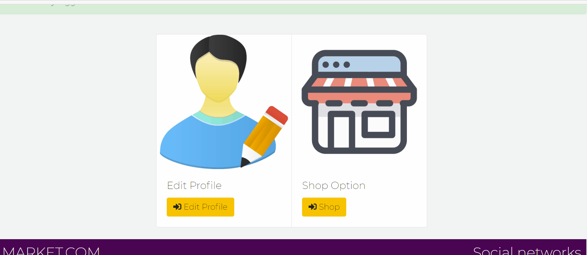
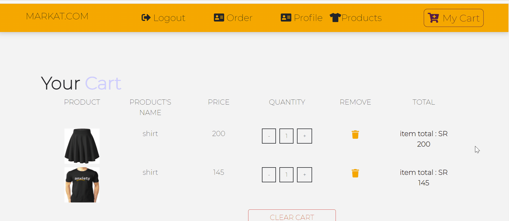
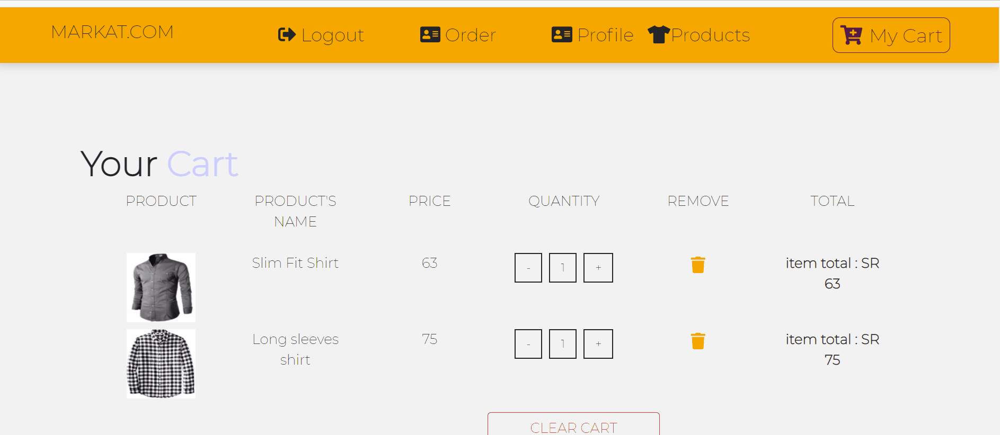

# Links 
## Link to the backend repo
https://git.generalassemb.ly/ammola/marketcom-backend

## Link to the frontend deployed site
https://pages.git.generalassemb.ly/ammola/marketcom-frontend/

## Link to the backend deployed site
http://marketcomweb007-env.eba-knfd2xiy.us-east-2.elasticbeanstalk.com/

# Used technologies
## Design tools
1) ERD design tool: sqlDBM
https://sqldbm.com/Home/

## Backend technologies
1) Programming language: Java 11
2) IDE: Eclipse EnterPrise
3) Platform: Spring Boot 
4) Security: 
Authentication: JWT 
Authorization: Spring Security
5) Build automation tool: Maven
6) Relational DataBase design tool: MySQL Workbench

## Frontend technologies
1) Package manager: npm
2) Ajax technology: Axios
3) UI library: React
4) React libraries: 
styled components: https://styled-components.com/
Smart Payment Buttons V2: https://www.npmjs.com/package/react-paypal-button-v2
React Router: https://www.npmjs.com/package/react-router
React Bootstrap: https://www.npmjs.com/package/react-bootstrap

## Unsolved problems
1) Diplay order details including the ordered products and their quantities.
2) Notify the seller of a new order made to one of (his/her) products.
3) Upload images of products. 

## Scrrenshots

## Home page

## Log in

## Edit profile

## Add shop

## Add a product to the cart

## Change prduct's quantity in the cart and remove a product from the cart

## Clear the cart

## Checkout with PayPal

## Home page

## Check the confirmed order

## Installation instructions
### Clone the repo
`git clone https://git.generalassemb.ly/ammola/marketcom-frontend.git`

### cd to the folder

### in the terminal run 
`npm install`

`npm start`

